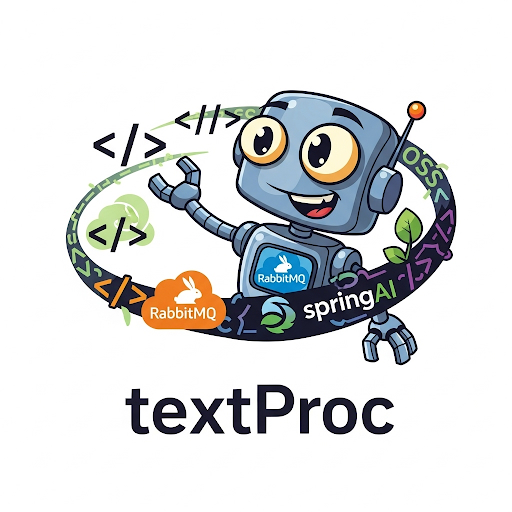

<div align="center">
  
  <h1>📝 textProc</h1>
  <p>
    <b>A powerful, event-driven document processing pipeline built with Spring Boot, Spring Cloud Data Flow, and Apache Tika.</b>
  </p>
  <p>
    <a href="https://img.shields.io/badge/Java-21-blue?logo=java"></a>
    <a href="https://img.shields.io/badge/Spring_Boot-3.4.5-brightgreen?logo=springboot"></a>
    <a href="https://img.shields.io/badge/Spring_Cloud-2024.0.1-orange?logo=spring"></a>
    <a href="https://img.shields.io/badge/Apache_Tika-2.9.2-yellow?logo=apache"></a>
    <a href="https://img.shields.io/badge/RabbitMQ-3.12.0-orange?logo=rabbitmq"></a>
    <a href="https://img.shields.io/badge/HDFS-3.3.0-lightblue?logo=apache"></a>
  </p>
</div>

---

## ✨ Features

- **📄 Multi-Format Document Processing**: Extracts text from a wide range of document formats, including PDF, DOCX, and more, using Apache Tika.
- **🚀 High-Performance & Scalable**: Built with Spring Boot and Spring Cloud Data Flow for robust, scalable, and event-driven processing.
- **📁 Multiple Data Sources**: Ingests files from local directories, S3/MinIO, and HDFS.
- **🎛️ Real-Time Control**: A web-based UI allows for real-time starting, stopping, and resetting of the processing flow, perfect for demos and management.
- **👁️ Live Monitoring**: A comprehensive web interface provides live stats, processed file tracking, and text previews.
- **🐳 Docker & Cloud Foundry Ready**: Easily deployable with Docker or to Cloud Foundry, with configuration provided.

---

## 🚀 Getting Started

### Prerequisites

- **Java 21+**
- **Maven 3.8+**
- **Docker** (for containerized deployment)
- **RabbitMQ** (for SCDF mode)
- **HDFS** (for HDFS file processing)

### Installation & Running

1.  **Clone the repository:**
    ```bash
    git clone https://github.com/your-username/textProc.git
    cd textProc
    ```

2.  **Build the application:**
    ```bash
    mvn clean package
    ```

3.  **Run in your desired mode:**

    - **Standalone Mode** (processes local files):
      ```bash
      mvn spring-boot:run -Dspring-boot.run.profiles=standalone
      ```

    - **SCDF Mode** (processes files from a RabbitMQ queue):
      ```bash
      mvn spring-boot:run -Dspring-boot.run.profiles=scdf
      ```

---

## ⚙️ Configuration

`textProc` can be configured via `application.properties` files or with environment variables, making it highly flexible for different deployment environments.

- **`application-standalone.properties`**: For local file processing.
- **`application-scdf.properties`**: For SCDF/RabbitMQ-driven workflows.
- **Environment Variables**: For containerized or cloud deployments (see `manifest.yml` for Cloud Foundry examples).

---

## Architecture

`textProc` is built on an event-driven architecture, ensuring loose coupling and high cohesion between its components. This design allows for greater flexibility, testability, and scalability.

<div align="center">
  
</div>

---

## 🐳 Deployment

Deploying `textProc` is simple, with support for both Docker and Cloud Foundry.

### Docker

1.  **Build the Docker image:**
    ```bash
    docker build -t textproc:latest .
    ```

2.  **Run with Docker Compose:**
    ```bash
    docker-compose up
    ```

### Cloud Foundry

1.  **Push to Cloud Foundry:**
    ```bash
    cf push
    ```

---

## 🤝 Contributing

Contributions are welcome! Please feel free to submit a pull request or open an issue.

---

## 📄 License

This project is licensed under the MIT License. See the [LICENSE](LICENSE) file for details.