<div align="center">
  
  <h1>📝 textProc</h1>
  <p><b>Headless, event-driven text extraction for your RAG pipelines — built on Spring Boot, Spring Cloud Stream, and Apache Tika.</b></p>
  <p>
    <a href="https://img.shields.io/badge/Java-21-blue?logo=java"></a>
    <a href="https://img.shields.io/badge/Spring_Boot-3.4.5-brightgreen?logo=springboot"></a>
    <a href="https://img.shields.io/badge/Spring_Cloud-2024.0.1-orange?logo=spring"></a>
    <a href="https://img.shields.io/badge/Apache_Tika-2.9.2-yellow?logo=apache"></a>
    <a href="https://img.shields.io/badge/RabbitMQ-3.12%2B-orange?logo=rabbitmq"></a>
    <a href="https://img.shields.io/badge/HDFS-3.3%2B-lightblue?logo=apache"></a>
  </p>
  <p>
    
    
  </p>
</div>

---

## ✨ Features

- **📄 Multi-Format Extraction**: Apache Tika-powered text extraction.
- **🔌 Headless Management**: Control via REST and Actuator; perfect for orchestration by an external app.
- **🧭 Dual Mode**: `standalone` (directory scanning) and `scdf` (RabbitMQ-driven stream).
- **📦 HDFS Output**: Writes processed text to HDFS `/processed_files` with safe filenames.
- **📊 Unified Metrics**: Publishes status to RabbitMQ `pipeline.metrics` with a shared schema and `meta.service` tag.
- **🛡️ Robust Lifecycle**: True pause/resume of SCDF bindings; no message loss while stopped.
- **🐳 Docker & CF Ready**: Container- and CF-friendly configuration.

---

## 🚀 Getting Started

### Prerequisites

- **Java 21+**
- **Maven 3.8+**
- **Docker** (for containerized deployment)
- **RabbitMQ** (for SCDF mode)
- **HDFS** (for HDFS file processing)

### Installation & Running

1.  **Clone the repository:**
    ```bash
    git clone https://github.com/your-username/textProc.git
    cd textProc
    ```

2.  **Build the application:**
    ```bash
    mvn clean package
    ```

3.  **Run in your desired mode:**

    - **Standalone Mode** (processes local files):
      ```bash
      mvn spring-boot:run -Dspring-boot.run.profiles=standalone
      ```

    - **SCDF Mode** (processes files from a RabbitMQ queue):
      ```bash
      mvn spring-boot:run -Dspring-boot.run.profiles=scdf
      ```

---

## ⚙️ Configuration

`textProc` is configured via `application.properties` or env vars:

- **Profiles**
  - `standalone`: scans `app.processor.standalone.input-directory`
  - `scdf`: binds to function `textProc` for RabbitMQ-driven processing

- **Actuator**
  - `management.endpoints.web.exposure.include=health,info,metrics,bindings,stream-control`

- **HDFS**
  - `app.hdfs.base-url=http://<namenode>:9870/webhdfs/v1`
  - `app.hdfs.processed-files-path=/processed_files`

- **Metrics Publishing (RabbitMQ)**
  - `app.monitoring.rabbitmq.enabled=true`
  - `app.monitoring.rabbitmq.queue-name=pipeline.metrics`
  - `app.monitoring.publish-interval-ms=5000`

---

## 🧠 Architecture

`textProc` uses an event-driven control plane and a function-based data plane.

```mermaid
flowchart LR
  subgraph Control_Plane["⚙️ Control Plane"]
    A[REST /api] --> B(ProcessingStateService)
    B --> C(ConsumerLifecycleService)
    C -->|Actuator| D[/stream-control/]
    B -->|Health| E((Actuator Health))
    F(TextProcMonitorService) --> G{{RabbitMQ pipeline.metrics}}
  end

  subgraph Data_Plane["📥 Data Plane"]
    H[(RabbitMQ Input)] --> I[[textProc Function]]
    I --> J[(HDFS /processed_files)]
  end

  style Control_Plane fill:#f8f9ff,stroke:#aab,stroke-width:1px
  style Data_Plane fill:#f6fff8,stroke:#9b9,stroke-width:1px
  style G fill:#fff7e6,stroke:#d9a,stroke-width:1px
```



---

## 📡 Management API

Base path: `/api`

| Method | Path                    | Description                                   |
|--------|-------------------------|-----------------------------------------------|
| POST   | `/processing/start`     | Start processing (resume SCDF binding)        |
| POST   | `/processing/stop`      | Stop processing (pause SCDF binding)          |
| POST   | `/processing/reset`     | Stop and clear HDFS processed files + memory  |
| GET    | `/processing/state`     | Current state and binding status              |
| GET    | `/files/processed`      | List processed files with metadata            |
| GET    | `/files/pending`        | Pending files (dir list or queue depth)       |

Examples:

```bash
curl -X POST http://localhost:8080/api/processing/start
curl -X POST http://localhost:8080/api/processing/stop
curl -X POST http://localhost:8080/api/processing/reset
curl http://localhost:8080/api/processing/state
curl http://localhost:8080/api/files/processed
curl http://localhost:8080/api/files/pending
```

Deploying `textProc` is simple, with support for both Docker and Cloud Foundry.

### Docker

1.  **Build the Docker image:**
    ```bash
    docker build -t textproc:latest .
    ```

2.  **Run with Docker Compose:**
    ```bash
    docker-compose up
    ```

### Cloud Foundry

1.  **Push to Cloud Foundry:**
    ```bash
    cf push
    ```

---

## 📈 Metrics and Health

- Actuator: `GET /actuator/health`, `GET /actuator/info`, `GET /actuator/metrics`, `GET /actuator/bindings`, `POST /actuator/stream-control`
- Health details include processing state, binding status, HDFS reachability, processed count.

### RabbitMQ Metrics Message (pipeline.metrics)

Schema (JSON):

```json
{
  "instanceId": "textProc-0",
  "timestamp": "2025-08-07T12:34:56",
  "totalChunks": 0,
  "processedChunks": 0,
  "errorCount": 0,
  "processingRate": 0.7,
  "uptime": "2h 15m",
  "status": "PROCESSING",
  "currentFile": null,
  "filesProcessed": 42,
  "filesTotal": -1,
  "lastError": null,
  "memoryUsedMB": 384,
  "pendingMessages": -1,
  "meta": {
    "service": "textProc",
    "processingState": "STARTED",
    "bindingState": "running",
    "hdfsProcessedDirExists": true,
    "inputMode": "scdf"
  }
}
```

Notes:
- A single neutral queue `pipeline.metrics` is shared by multiple services; consumers can switch on `meta.service`.
- Optional fields may be `null` or omitted.

Contributions are welcome! Please feel free to submit a pull request or open an issue.

---

## 📄 License

This project is licensed under the MIT License. See the [LICENSE](LICENSE) file for details.